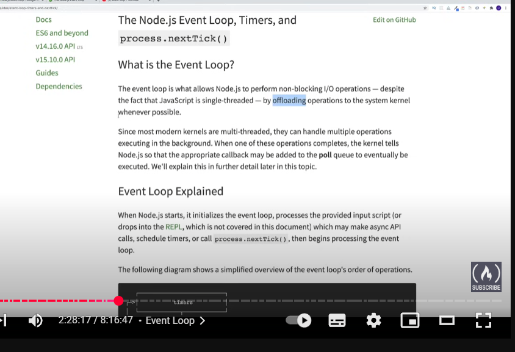
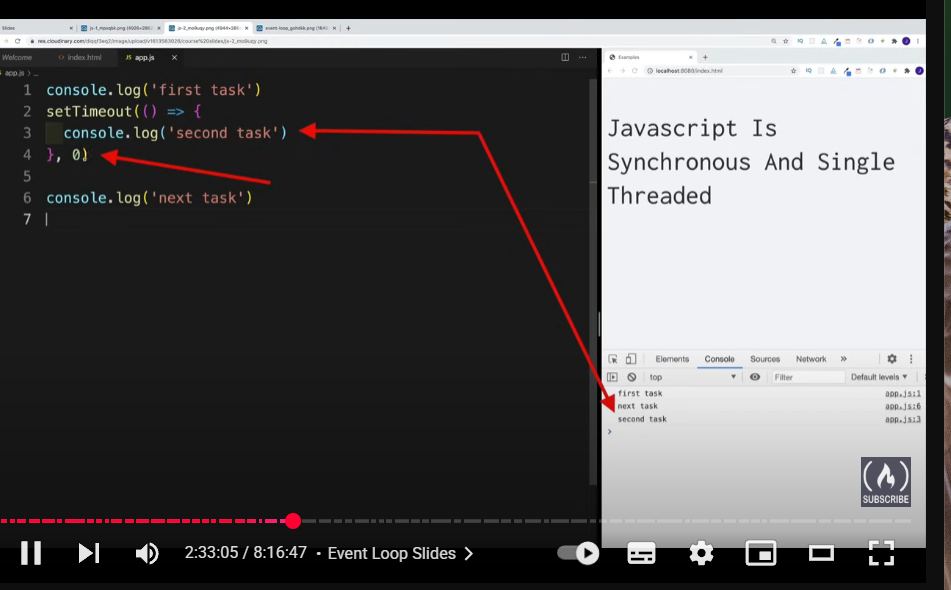

## Built in modules 

##What is modules 

//npm -Node package manager
npmjs.com
//pacahge is a folder with code 

//package lock json have versions of all other package who are holding other dependencies
//nodesource.com for more ob package json 

//Event loop

for more nodejs.dev
//see some more  content on yt for event loop

